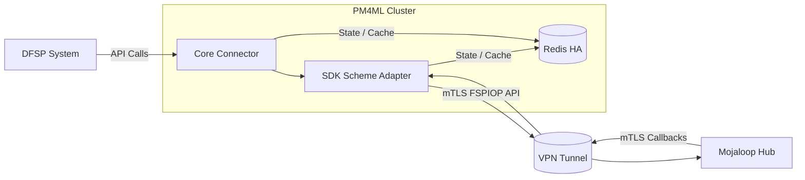

# PM4ML Deployment Guide – Helm Installation

This document describes the deployment maintained in the following project:

👉 [PM4ML Deployment Repository](https://github.com/ThitsaX/pm4ml-deployment)

## ⚠️ **Note**
This guide describes a **minimal PM4ML deployment using Helm**.  
It is intended for integration environments or basic deployments.

Production environments may require additional components such as:
- Centralized logging
- Monitoring and alerting
- Backup and recovery
- Secret management
- High availability architecture

---
This deployment guide installs the following core components:

- Redis HA
- PM4ML Helm chart
- mTLS configuration
- Ingress configuration

---

## Architecture Overview

The following diagram shows how **PM4ML connects a DFSP to the Mojaloop Hub**.



### Component Overview

| Component              | Description                                   |
| ---------------------- | --------------------------------------------- |
| **SDK Scheme Adapter** | Handles Mojaloop SDK API interactions         |
| **Core Connector**     | Communicates with the Mojaloop Hub            |
| **Redis**              | Used for caching and message state management |
| **Ingress / Gateway**  | Exposes PM4ML endpoints to external systems   |

---

## Prerequisites

Ensure the following components are available in your Kubernetes environment:

- Kubernetes cluster
- kubectl
- Helm v3+
- A **default StorageClass** or an available StorageClass for persistent volumes

PM4ML uses Redis HA, which requires persistent storage.
Your Kubernetes cluster must provide a **dynamic StorageClass** capable of provisioning PersistentVolumes.
For Redis workloads, lower-latency storage is generally preferred. However, the optimal storage backend depends on the infrastructure and operational model of the Kubernetes cluster.

Common examples include:

- **Ceph / Rook-Ceph**
- **Cloud provider disks** (AWS EBS, GCP Persistent Disk, Azure Disk)
- **Longhorn** (commonly used for on-prem Kubernetes, but may introduce additional latency)
- **Local Persistent Volumes** (low latency, but ties workloads to specific nodes)

You can check available StorageClasses with:

```bash
kubectl get storageclass
```

Verify cluster access:
```bash
kubectl get nodes
```

---
## Configuration

Before deploying PM4ML, review and update the configuration files in this repository to match your environment.

### Helm Values

Update the following Helm values files as needed:

| File | Purpose |
|-----|------|
| `helm-values/values-redis-ha.yaml` | Redis HA configuration |
| `helm-values/values-pm4ml.yaml` | PM4ML application configuration |

Typical parameters to review:

- StorageClass
- Resource requests and limits
- External Mojaloop Hub endpoints
- Redis configuration
- Environment-specific values

---

### Networking Configuration

Review the networking configuration files under the `networking/` directory.

| File | Purpose |
|------|------|
| `networking/pm4ml-mtls.yaml` | Mutual TLS configuration |
| `networking/ingress.yaml` | External access configuration |

Update the following items:

- Domain names
- TLS certificates
- Gateway or ingress controller configuration
- Hostnames used for PM4ML endpoints

---

### Storage Configuration

Ensure your Kubernetes cluster has a **default StorageClass** or update the Redis values file with the appropriate StorageClass.

## 1. Add Helm Repositories

```bash
helm repo add dandydeveloper https://dandydeveloper.github.io/charts
helm repo add pm4ml https://pm4ml.github.io/mojaloop-payment-manager-helm/repo
helm repo update
```

---

## 2. Deploy Redis

Create a namespace first.

```bash
kubectl create namespace pm4ml
```

Install Redis HA:

```bash
helm install redis-ha \
  dandydeveloper/redis-ha \
  --version 4.35.5 \
  -n pm4ml \
  -f helm-values/values-redis-ha.yaml
```

Verify Redis deployment:

```bash
kubectl get pods -n pm4ml
```

---

## 3. Deploy PM4ML

Install PM4ML:

```bash
helm install pm4ml \
  pm4ml/mojaloop-payment-manager \
  --version 10.2.0 \
  -n pm4ml \
  -f helm-values/values-pm4ml.yaml
```

Verify deployment:

```bash
kubectl get pods -n pm4ml
```

---

## 4. Configure Networking

Apply mTLS configuration:

```bash
kubectl apply -f networking/pm4ml-mtls.yaml
```

Apply ingress configuration:

```bash
kubectl apply -f networking/ingress.yaml
```

---

## 5. Verify Deployment

Check all PM4ML resources:

```bash
kubectl get all -n pm4ml
```

---

## Notes

This deployment installs:

* Redis HA
* PM4ML Helm chart version **10.2.0**

Service names follow the Helm release name:

```
pm4ml-*
```

Examples:

```
pm4ml-mojaloop-core-connector
pm4ml-sdk-scheme-adapter-api-svc
```

---

## Ingress Configuration

PM4ML requires external access to several services.

The ingress configuration depends on the ingress controller used in your Kubernetes cluster (for example **NGINX, Istio, Traefik, AWS ALB**).

Update the ingress configuration according to your environment.

### Required Endpoints

| Endpoint                    | Service                          | Port | Purpose            |
| --------------------------- | -------------------------------- | ---- | ------------------ |
| conn-<domain>               | pm4ml-sdk-scheme-adapter-api-svc | 4000 | Inbound Mojaloop SDK connector from HUB |
| sdk-core-connector-<domain> | pm4ml-mojaloop-core-connector    | 3003 | Core connector SDK |
| fsp-core-connector-<domain> | pm4ml-mojaloop-core-connector    | 3004 | Core connector FSP |

Example domain configuration:

```
conn-pm4ml.example.com
sdk-core-connector-pm4ml.example.com
fsp-core-connector-pm4ml.example.com
```

### Example (Istio)

If using Istio, refer to the example `VirtualService` manifest provided in this repository.

### Example (NGINX Ingress)

If using NGINX ingress, configure routes to the services listed above using standard Kubernetes `Ingress` resources.

---

## Production Considerations

Production deployments should also include:

* Mutual TLS (mTLS) between **Hub and PM4ML**
* Monitoring and alerting
* Backup strategy
* Secret management
* High availability configuration

---

## Disclaimer

This deployment guide provides general instructions for deploying **PM4ML in Kubernetes environments** and supports deployment in both **cloud-based** and **on-premise** infrastructure, depending on DFSP requirements.

As infrastructure, networking, security, and operational models vary between DFSPs, the final deployment approach may differ from one environment to another. DFSPs may proceed with their preferred deployment setup according to their own technical and operational requirements.

### Log Management

Log management cannot be fully controlled or standardized within the PM4ML deployment itself, as log generation, retention, aggregation, and visibility depend on the underlying Kubernetes platform and the logging stack implemented in the environment.

If a DFSP requires centralized or advanced logging capability, they will need to deploy the appropriate supporting components as part of the full PM4ML stack or integrate PM4ML with their existing logging solution.

### Troubleshooting Responsibility

Each DFSP operates and manages its own PM4ML deployment environment. Therefore, initial troubleshooting and operational investigation remain the responsibility of the DFSP.

Issues related to infrastructure, networking, Kubernetes configuration, storage, ingress, certificates, or logging should be investigated within the DFSP environment first. Platform or integration teams may assist with application-level investigation where required, but environment-level troubleshooting remains under the DFSP’s responsibility.

---